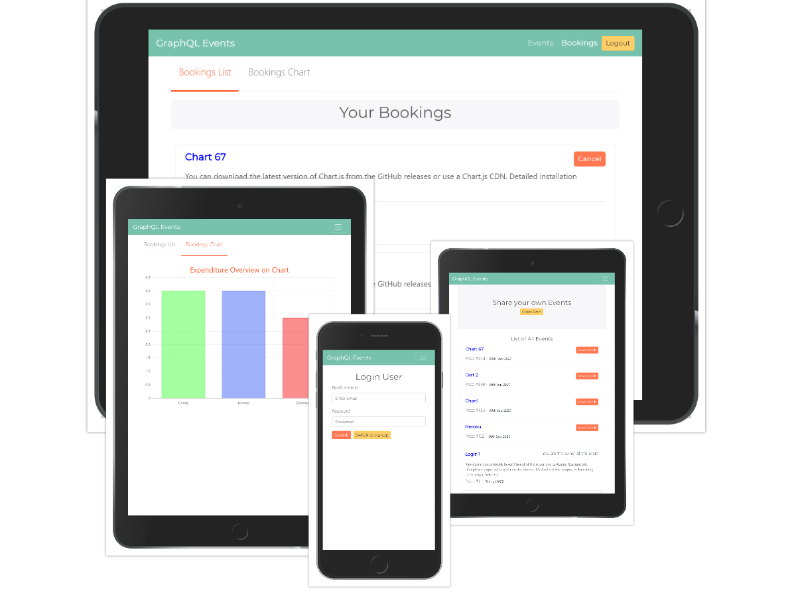

# Event Booking App

- #### This site is live [here](https://event--booking.herokuapp.com).
- #### Github Repository [link](https://github.com/nil1729/event-booking-graphql).

---

### Modules used for this Project

1. _`NodeJS`_ is used for building Backend part of this Website.
2. _`MongoDB`_ used for Database to store data.
3. _`ExpressJS`_ is used as Backend Framework.
4. _`GarphQL`_ is used for fetching API calls.
5. _`React JS`_ is used as frontend Framework for building SPA.
6. _`Bootswatch Minty Theme`_ is used as CSS Framework and the website is Responsive for all Devices.
7. _`ChartJS`_ is used for Charting the responses and Data.

8. _`JWT`_ is used for Authentication purpose.
9. Token will be stored in `Local Storage` of Client Browser.
10. Encrypt passwords with `bcrypt`

11. _`ChartJS`_ is used for charting the Data got from Bookings.
12. Easily Understandable to all users.

---

### Website Preview

## 

Made With &#10084; by <a href="https://github.com/nil1729" target="_blank"> Nilanjan Deb </a> 

